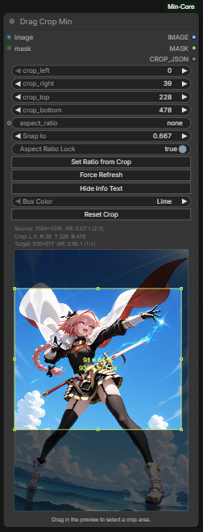

# Drag Crop Min

This node allows you to visually crop an image by dragging a selection box over the image preview in the ComfyUI interface.

It outputs the cropped `IMAGE` and a `MASK` of the cropped area. It also outputs a `CROP_JSON` containing the crop coordinates and dimensions which can be interpreted by the **Crop Info → Values Min** node.

## Credits

This node is a port of the excellent [ComfyUI-Olm-DragCrop](https://github.com/o-l-l-i/ComfyUI-Olm-DragCrop) by [o-l-l-i](https://github.com/o-l-l-i).

## Inputs

- `image`: The input `IMAGE` to crop.
- `mask` (optional): An optional `MASK` to crop alongside the image.

(Other internal inputs are hidden and used by the UI to track the crop area).

## Outputs

- `IMAGE`: The cropped image tensor.
- `MASK`: The cropped mask tensor (if a mask was provided) or a blank mask of the new size.
- `CROP_JSON`: A JSON string containing the crop parameters (`left`, `top`, `right`, `bottom`, `width`, `height`, etc.).

---

# Crop Info → Values Min

This companion node parses the `CROP_JSON` generated by **Drag Crop Min** into individual integer values and formatted strings for use in other nodes.

## Inputs

- `crop_json`: The JSON string from **Drag Crop Min**.

## Outputs

- `left`, `top`, `right`, `bottom`, `width`, `height` (INT): Individual crop dimensions.
- `csv` (STRING): A comma-separated list of the dimensions.
- `pretty` (STRING): A human-readable summary of the dimensions.

