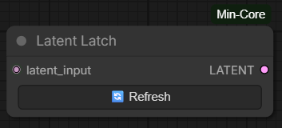

# Latent Latch

## Overview

Latent Latch is a ComfyUI node acting as a savepoint/checkpoint mechanism specifically designed for latent data. It optimizes workflows with long generation times or multiple samplers by stopping upstream execution if it already has a saved latent for the given execution path.

## How it works

1. **Lazy Evaluation:** `LatentLatch` uses ComfyUI's `lazy` evaluation feature. When the workflow runs, ComfyUI checks with this node whether it needs its upstream inputs evaluated. 
2. **Latch Status:**
    - If the `block` input is **True** and the node has a latched latent file saved on disk, it does **not** evaluate its upstream nodes. It loads the file from disk and outputs it directly. This saves significant generation time.
    - If the `block` input is **False**, or the node does **not** have a latched file on disk, it requests the upstream nodes to execute, saves the incoming latent to disk, and outputs it.
3. **Cache Invalidation:** ComfyUI caches nodes based on their inputs. To force an update, `LatentLatch` has an internal version string that is bumped when you press the **Refresh** button.

## Usage
Add `LatentLatch` to your workflow between expensive operations (e.g., between two KSamplers, or right after a long VAE Encode). 

### Inputs
- **block** (Boolean, default: True): Controls whether the node should use the latched file (if present). If set to `False`, the node bypasses the latch and always evaluates the upstream nodes, capturing a fresh latent. This input can be converted to an input socket to be dynamically controlled by other nodes.

### Buttons
- **🔄 Refresh:** This button releases the latch. It deletes the saved file and invalidates ComfyUI's cache for this node. The next time you run the workflow, the upstream nodes will be re-evaluated to capture a fresh latent. Even if `block` is True, pressing Refresh will force a single upstream evaluation.

### Visual Feedback
The node provides visual feedback to indicate its current state:
- **Default color:** The node is not latched (no file saved).
- **Dark blue color:** The node is currently latched. Running the workflow will use the saved data without executing upstream nodes.

## Cache Stability

When a latent is latched, the node produces a **stable cache fingerprint** based on the modification time of the saved file on disk. This means that downstream nodes (e.g. a second KSampler) can re-run **without forcing upstream nodes to re-execute** — the latched latent is simply loaded from disk.

This is especially useful in multi-sampler pipelines: you can iterate on later stages without regenerating earlier (potentially expensive) results.

## Storage
The latched latents are saved as SafeTensors files in the `input/mincore/latent_latch/` directory inside your ComfyUI installation.
- **Persistence:** Because the files are stored in `input/`, they survive ComfyUI restarts and temp directory cleanups.
- **Cleanup:** You can manually delete the files in this directory if you want to free up space. Doing so will simply unlatch all nodes.
