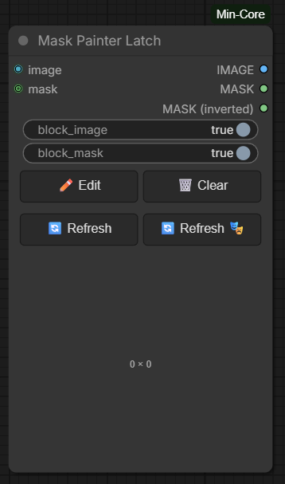

# Mask Painter Latch

## Overview

Mask Painter Latch is a ComfyUI node that combines mask-painting functionality with latch (savepoint) mechanics. It allows you to paint a mask on top of any image using ComfyUI's native mask editor, while persisting both the painted mask and the background image to disk between runs. This avoids re-evaluating expensive upstream nodes when the mask hasn't changed.

This node was created based on the [NKD Mask Painter](https://github.com/Nekodificador/ComfyUI-NKD-Preview-Tools) node from the ComfyUI-NKD-Preview-Tools pack.

## How it works

1. **Lazy Evaluation:** Both `image` and `mask` inputs use ComfyUI's `lazy` evaluation. The node decides at runtime whether each upstream input needs to be evaluated.
2. **Independent Blocking:**
   - `block_image=True` + image backup on disk → image is loaded from disk, upstream image source is NOT executed.
   - `block_mask=True` + mask backup on disk → mask is loaded from disk, upstream mask source is NOT executed.
   - Setting either to `False` forces re-evaluation of the respective input every run.
3. **Mask Editor:** The node integrates with ComfyUI's native mask editor (via clipspace). The painted mask is stored as the alpha channel of an RGBA PNG and backed up to disk.
4. **Cache Invalidation:** An internal version string is bumped when buttons are pressed, invalidating ComfyUI's node cache.

## Usage

Add Mask Painter Latch to your workflow where you need to paint a mask on an image. Connect an image source to the `image` input and optionally a mask source to the `mask` input.

### Inputs

- **image** (IMAGE, lazy) — Background image displayed in the editor and passed through to the IMAGE output.
- **mask** (MASK, optional, lazy) — Optional upstream mask. Press Refresh Mask to load it into the editor canvas, replacing the current painted mask.
- **block_image** (Boolean, default: True) — Controls whether the image is loaded from disk (True) or re-evaluated from upstream (False). Can be connected to another node for dynamic control.
- **block_mask** (Boolean, default: True) — Controls whether the mask is loaded from disk (True) or re-evaluated from upstream (False). Can be connected to another node for dynamic control.

### Outputs

- **IMAGE** — Passthrough of the background image.
- **MASK** — The painted mask (1.0 = masked region).
- **MASK (inverted)** — The inverted mask (1.0 = unmasked region).

### Buttons

- **✏️ Edit** — Opens ComfyUI's native mask editor. Paint or erase mask regions on top of the background image. The mask is saved when you close the editor.
- **🗑️ Clear** — Clears both the background image and the mask from disk, then triggers an evaluation to fetch a fresh image from upstream.
- **🔄 Refresh** — Forces re-evaluation of the `image` input only (fetches a new background from upstream). The current painted mask is preserved.
- **🔄 Refresh 🎭** — Forces re-evaluation of the `mask` input only (loads a new mask from upstream). The current background image is preserved.

### Visual Feedback

The node changes color to indicate its current state:
- **Default color** — No mask painted, not latched.
- **Dark green** — A mask is currently painted.
- **Dark blue** — The node is latched (data loaded from disk, upstream not executed). This appears when there is no mask painted but backup data exists.

## Storage

Both the mask and the background image are saved to `input/mincore_mask_painter_latch/` inside your ComfyUI installation:
- `{node_id}_mask.png` — Grayscale mask (255 = masked, 0 = unmasked).
- `{node_id}_image.png` — Background image (RGB).

Because the files are stored in `input/`, they survive ComfyUI restarts and temp directory cleanups. You can manually delete the files to reset all nodes.
