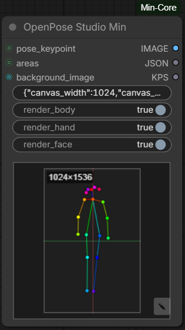
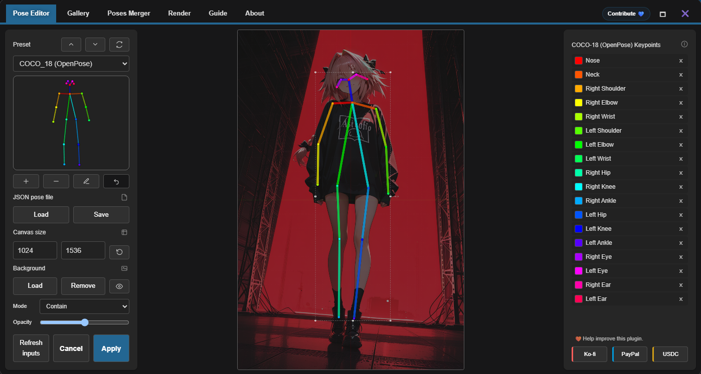

# OpenPose Studio Min

## Overview

OpenPose Studio Min is a pose editor + renderer node for ComfyUI, ported from the
[ComfyUI-OpenPose-Studio](https://github.com/andreszs/comfyui-openpose-studio)
pack by andreszs. It provides a full in-browser pose editor (canvas, presets,
gallery, merger, render style, localization) and converts the edited pose into:

- a rendered **IMAGE** (body skeleton / hands / face)
- the filtered **JSON** that was edited
- a **POSE_KEYPOINT** output compatible with `comfyui_controlnet_aux` (DWPose)

## Nodes

- **OpenPose Studio Min** (`MinCore_OpenPoseStudio`) — the main pose editor + renderer.
- **Show String** (`MinCore_ShowString`) — a helper output node that displays a
  text value in the UI (input-list aware).

## OpenPose Studio Min — How it works

1. **Editor:** Right-click the node → *Open in Editor* (or click the preview
   widget) to open the full pose editor panel. Drag keypoints, load bundled
   presets, import JSON files, and adjust the canvas size. Right-click a
   keypoint to delete it instantly (equivalent to dragging it into the trash
   target in the top-right corner); the browser context menu is suppressed only
   when a keypoint is hit.
2. **Rendering:** On execution, the `pose_json` widget value is parsed and drawn
   onto a black canvas using the runtime render style (configurable in the
   editor's Render Style tab and synced to the backend via REST).
3. **Outputs:** The rendered image is emitted as IMAGE, the (possibly filtered)
   pose JSON as JSON, and the converted pose as KPS for controlnet nodes.
4. **DWPose passthrough:** If a `POSE_KEYPOINT` is connected to the `pose_keypoint`
   input, it is serialized to JSON and used instead of the `pose_json` widget value.

### Editor interface

The editor panel is a full-window overlay divided into tabs:

- **Pose Editor** — the main canvas plus the left control sidebar.
- **Gallery** — browse the bundled pose library and insert poses.
- **Poses Merger** — merge multiple pose JSON files into one canvas.
- **Render** — adjust the runtime render style (line width, keypoint radius,
  colors for body / hands / face).

The **Pose Editor** tab is laid out as follows:

- **Left sidebar:**
  - **Preset** — dropdown with the bundled presets, prev/next/reload buttons and
    a live preview thumbnail.
  - **Action row** — add a pose (**+**), remove the selected pose (**−**), clear
    the canvas, undo the last edit.
  - **JSON pose file** — **Load** / **Save** buttons to import/export pose JSON.
  - **Canvas size** — width/height inputs (64–4096, step 64) plus a reset-size
    button that restores the default 512×512 dimensions. Resizing scales the
    existing keypoints proportionally.
  - **Background** — **Load** / **Remove** a local background image, choose
    `contain` or `cover` fit mode and an opacity slider. A connected
    `background_image` input takes priority over the locally loaded one while
    present (see Inputs). The **eye** button toggles the conditioning-area
    overlay when `areas` is connected; without `areas` it shows a prompt that
    links to the conditioning pipeline pack instead.
- **Right sidebar:** the COCO keypoint list for the selected pose — click a
  keypoint name to select it on the canvas, hover to highlight, use **X** to
  delete it.
- **Canvas:** the editing area described below.
- **Footer:** **Refresh inputs** (re-queues just this node to fetch connected
  inputs without closing the panel), **Cancel**, **Apply** (commits the pose to
  the node and queues this node).

### Editing

- **Move** keypoints by dragging them; drag a pose body to move the whole pose.
- **Multi-select:** **Shift+Click** toggles keypoints; **Shift+drag** draws a
  marquee rectangle to select several keypoints at once. Dragging any selected
  keypoint moves the whole selection.
- **Pose transforms:** the selection box offers scale, rotate and mirror
  handles (vertical / horizontal).
- **Delete:** right-click a keypoint, or drag it into the red trash target in
  the top-right corner.
- **Connect skeleton:** double-click a loose keypoint to auto-complete the
  missing chain to the nearest neighbor along the skeleton topology.
- **Hand editor:** with a hand selected, click its **edit** handle to enter
  hand-edit mode and refine the 21 finger keypoints in a zoomed view.
- **Viewport:** scroll wheel zooms, middle-button drag pans, double-click on
  empty space resets the view (see Viewport navigation below).

### Inputs

- **pose_json** (STRING, default: "") — Pose JSON from the editor. Editor format:
  `{"width": W, "height": H, "keypoints": [[[x1,y1], ...], ...]}`.
  Also accepts the standard `{"canvas_width", "canvas_height", "people": [...]}`
  (DWPose) format.
- **render_body** (Boolean, default: True) — Whether to draw the body skeleton.
- **render_hand** (Boolean, default: True) — Whether to draw hands.
- **render_face** (Boolean, default: True) — Whether to draw face keypoints.
- **pose_keypoint** (POSE_KEYPOINT, optional) — When connected, overrides the
  widget value.
- **pose_tags** (STRING, optional) — Comma-separated tags describing the pose
  (e.g. `sitting, japanese, indoor`). Passed to the editor so they pre-fill the
  **Save to Gallery** dialog. Only metadata; it does not affect rendering.
- **areas** (CONDITIONING_AREAS, optional) — Conditioning area data shown as an
  overlay in the editor canvas (used with Conditioning Pipeline nodes).
- **background_image** (IMAGE, optional) — When connected, the image is shown as
  the background of the editor canvas (like the local file-picker background).
  The canvas automatically resizes to the image dimensions and existing
  keypoints are scaled proportionally. The image is only used as an editor
  reference; it is not composited into the IMAGE output. Connected inputs
  (`background_image`, `pose_keypoint`) are picked up when the node is queued:
  clicking **Apply** in the editor queues just this node (and its upstream
  dependencies), and the editor toolbar's **Refresh inputs** button re-queues
  it without closing the panel so the background refreshes in place.

The node is registered as an output node, so it can be queued on its own (e.g.
via the editor's **Apply** / **Refresh inputs** buttons) to fetch its inputs
without running downstream nodes.

### Outputs

- **IMAGE** — Rendered pose image (batch of 1, RGB 0-1).
- **JSON** — Filtered pose JSON (components stripped according to the render flags).
- **KPS** — Pose in POSE_KEYPOINT format (`{canvas_width, canvas_height, people}`)
  with flattened `[x, y, conf]` triplets in pixel space.

### Viewport navigation

- **Scroll wheel** — zoom in/out around the cursor position (range ~0.1× to 10×).
- **Middle-button drag** — pan the viewport.
- **Double-click on empty space** — reset zoom/pan to fit.

Zoom/pan only affect the editor viewport; they never change the pose
coordinates or the rendered outputs. Zoom is disabled while hand-edit mode is
active.

## Format support

Both **COCO-17** (Ultralytics/TF.js, 17 keypoints, no neck) and **COCO-18**
(OpenPose, 18 keypoints with neck) are detected automatically from the flat
keypoint count and rendered with the appropriate skeleton colors and topology.

## Show String — How it works

A simple output node. Any `text` input received (as a list) is echoed back to
the UI as a read-only multiline display widget.

### Inputs

- **text** (STRING, forceInput) — Text to display.

### Outputs

None (output node).

## Pose library

The bundled `poses/` directory ships with ~40 preset JSON files organized into
categories (`misc/`, `dev/`). Additional pose libraries can be added to ComfyUI
via the `mincore_openpose_poses` model folder key. The editor's Gallery and
preset dropdown load from these files through the `/mincore/openpose/poses` REST
endpoint.

The shipped `poses/` directory is read-only. Poses saved from the editor are
written to `input/mincore/user_poses/` under ComfyUI's input directory, so they
survive plugin updates and reinstalls.

## Save to Gallery

The **Save to Gallery** button in the **JSON pose file** section writes the
current canvas into the pose library so it shows up in the Gallery and the
preset dropdown:

1. A dialog asks for a **name** (pre-filled with an auto-generated
   `saved-YYYYMMDD-HHMMSS` value; leave empty to keep the auto name) and
   **tags** (pre-filled from the `pose_tags` input).
2. The pose is sent to `POST /mincore/openpose/poses/save`, which adds a
   top-level `metadata` object (`{"name": ..., "tags": ...}`) and writes the
   file to `input/mincore/user_poses/saved/` in ComfyUI's input directory.
3. Filename collisions get a numeric suffix (`-2`, `-3`, ...) instead of being
   overwritten; the name is sanitized to safe filesystem characters.
4. On success the Gallery reloads and the saved pose appears under the `saved`
   group with its tags shown in the details panel.

Tags are stored as plain comma-separated text in the JSON `metadata` block and
are also searched by the Gallery filter.

## Render style

Render settings (line width, keypoint radius, colors for body/hands/face) are
stored in the browser's localStorage and synced to the backend via
`POST /mincore/openpose/render_style`. The backend includes a fingerprint of the
current style in the node's cache key (`fingerprint_inputs`), so changing the
style in the editor correctly invalidates ComfyUI's cache and re-renders.

## Localization

The editor UI is localized (11 languages). Language dictionaries live in
`locales/<lang>/ui.json` and are served through
`GET /mincore/openpose/locales/{lang}/ui.json`.
