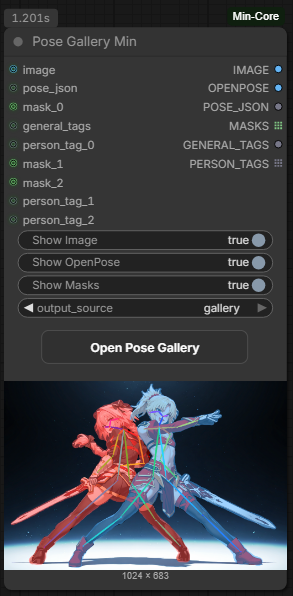
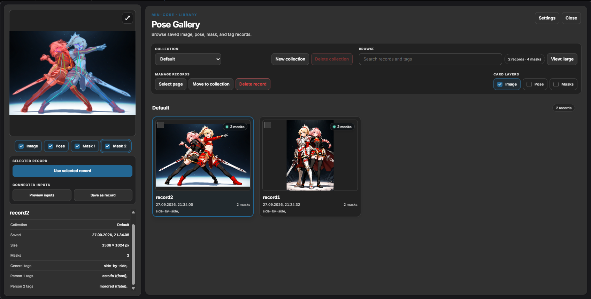

# Pose Gallery Min

Pose Gallery Min saves and reuses records containing pose JSON, masks, tags, and
an optional source image. Open the gallery with **Open Pose Gallery** on the
node or from its context menu. Collections help organize records and can be
managed from the gallery.

In the gallery, **Save as record** stores connected inputs and **Preview inputs**
shows them without saving or changing the current output. To use a saved record,
select it and click **Use selected record**. The gallery closes automatically
after the record is queued for use. Records can be browsed with their image,
pose, and mask layers.

Records are stored locally in `ComfyUI/input/mincore/pose_gallery/` and are not
embedded in workflow files. To use a workflow with saved records on another
installation, copy the gallery data there as well.

## Inputs

- **image** (IMAGE, optional) — source image for the record.
- **pose_json** (STRING, optional) — pose data used to render the OpenPose image.
- **masks** — dynamic MASK inputs (`mask_0`, `mask_1`, …).
- **general_tags** (STRING, optional) — tags for the whole record.
- **person_tags** — dynamic STRING inputs (`person_tag_0`, `person_tag_1`, …),
  corresponding to people in the pose JSON.
- **output_source** — `inputs` uses connected values; `gallery` uses the selected
  saved record. If none is selected, the node uses connected inputs.
- **Show Image**, **Show OpenPose**, **Show Masks** — control the node preview
  only; they do not change outputs or saved records.

## Outputs

- **IMAGE** — source image.
- **OPENPOSE** — image rendered from `pose_json`.
- **POSE_JSON** — pose data.
- **MASKS** — list of masks.
- **GENERAL_TAGS** — tags for the whole record.
- **PERSON_TAGS** — list of per-person tags.

When the image or masks are missing, black/zero placeholders keep their outputs
usable. Missing tag values are returned as empty strings. Masks and person tags
use list-valued outputs rather than separate sockets.
