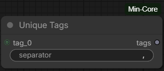

# Unique Tags

## Overview

`Unique Tags` combines tags from multiple dynamic text inputs and removes duplicate tags. It works with tags from any prompt workflow.



## Inputs

- **tag_0, tag_1, ...**: Dynamic text inputs. Each input can contain multiple tags.
- **separator**: Text used to split tags and join the output. The default is `,`.

The node provides up to 100 dynamic tag inputs. ComfyUI adds inputs as they are connected or used.

## Processing

For every input, the node:

1. Splits the text using the selected separator.
2. Removes whitespace from the beginning and end of each tag.
3. Skips empty tags.
4. Keeps only the first occurrence of each exact tag.

The original tag order is preserved. Whitespace inside a tag is not changed. Tag comparison is case-sensitive, so `cat` and `Cat` are different tags.

## Example

With separator `,`:

- `tag_0`: `  portrait, blue eyes`
- `tag_1`: `blue eyes, detailed hair`

Output:

```text
portrait,blue eyes,detailed hair
```

An empty separator is invalid.
